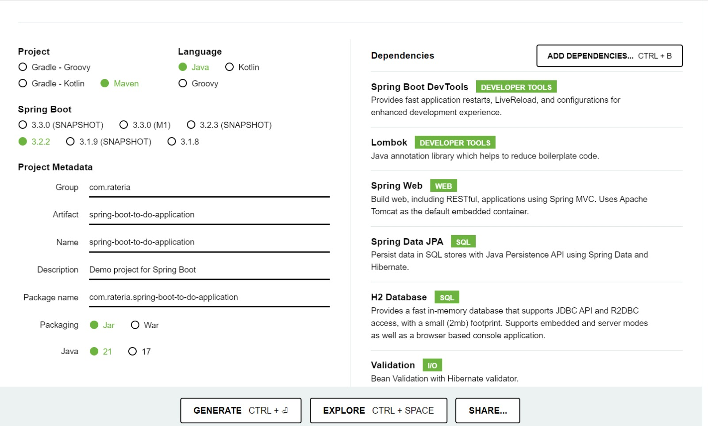
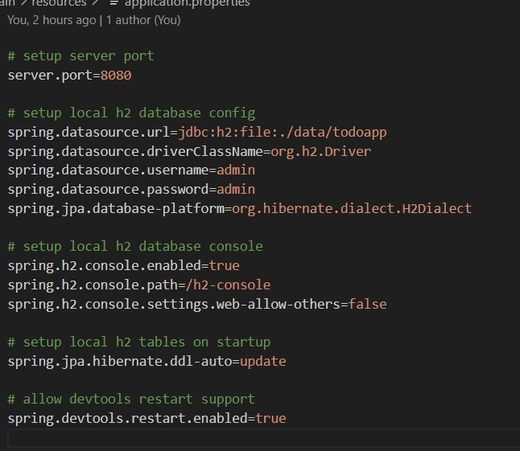
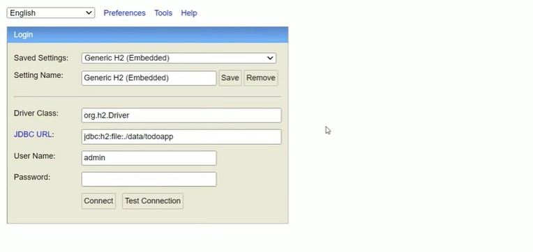

# PROCESS

### To get started I first downloaded a spring boot file with the following specifications

These dependencies are
- Spring data JPA
- Spring boot dev tools
- Lombok
- Spring web
- h2- database
- validation

### next steps
I then downloaded the following softwares:
- maven
- git
- h2 database console
- java development kit

Later, in the file 'application properties', i put the following code that specifies port and other specifications:

In the next step, i ran the app and opened 'http://localhost:8080/h2-console' link on my browser and connected the app to my localhost. This was the screen :

